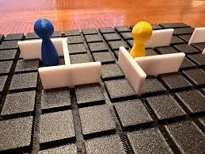

# Quoridor Implementation on LandTiger

### The goal of this project is to implement the [Quoridor](https://it.wikipedia.org/wiki/Quoridor) board game on the LandTiger board with the Keil uVision IDE.

    

        Several features were implemented such as:
        <ul>
            <li>1 vs 1 match on the same board</li>
            <li>1 vs NPC match (computer player) on the same board</li>
            <li>1 vs 1 match on different board (to be completed)</li>
        </ul>
    

    

        
    

    The project was implemented almost entirely in the C language, using both the emulator provided by Keil and the LandTiger board. Various components were used such as the LCD touch screen, joysticks, buttons, timers, the CAN port was used for inter-board communications, the RIT timer used to handle joystick movements and button debouncing was set to 50ms.

## Start a match

After pressing the int0 button you enter the menu where you can select the match type, any confirmation must be made using the "select" button on the joystick.
At the end of each game you can return to the main menu by pressing the reset button.
